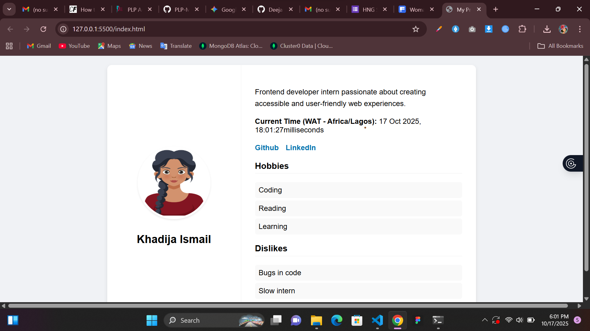
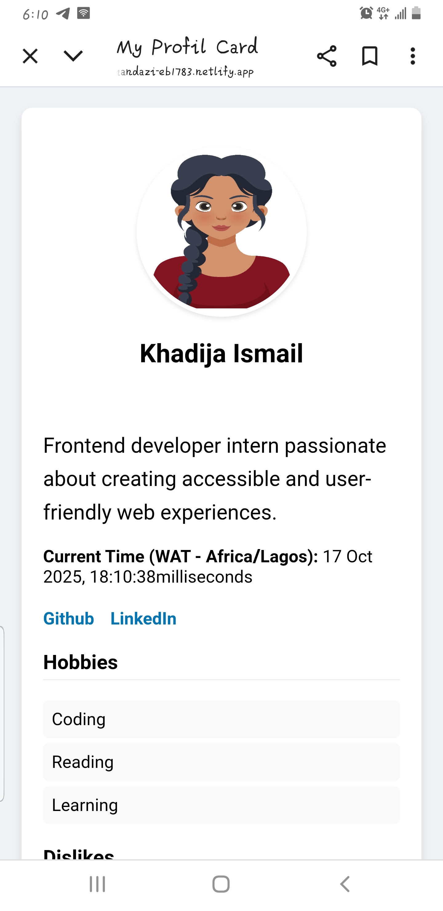

# Profile Card Component - Frontend Wizards Stage 0

This project is a responsive, accessible, and testable profile card built as part of the Stage 0 task for the Frontend Wizards internship. It is created using plain HTML, CSS, and vanilla JavaScript, with a strong focus on semantic markup and modern frontend practices.

---

## ✨ Live Demo

You can view the live project hosted here:

**[https://your-live-url.netlify.app/](https://your-live-url.netlify.app/)**

---

## 📸 Screenshots


```markdown


```

---

## ✅ Core Requirements Checklist

This project successfully implements all the core requirements from the task description:

-   [x] **All `data-testid` Attributes:** Every required element includes the specified `data-testid` for automated testing.
-   [x] **Semantic HTML:** The structure uses semantic tags like `<article>`, `<header>`, `<section>`, `<figure>`, and `<nav>` to improve accessibility and SEO.
-   [x] **Responsiveness:** The layout is fully responsive, stacking vertically on mobile screens and transitioning to a two-column layout on wider screens (tablets/desktops) using CSS Flexbox.
-   [x] **Dynamic Time Display:** The current time in milliseconds is accurately displayed using `Date.now()` and updates every second.
-   [x] **Accessible Images:** The avatar `` includes a descriptive `alt` attribute.
-   [x] **Accessible Links:** Social media links open in a new tab with `target="_blank"` and `rel="noopener noreferrer"` for security.
-   [x] **Keyboard Navigation:** All interactive elements (links) are keyboard-focusable with a visible focus style for better accessibility.
-   [x] **Distinct Lists:** Hobbies and Dislikes are presented in separate `<ul>` elements within their own sections.

---

## 🛠️ Technologies Used

-   **HTML5:** For the core structure and content.
-   **CSS3:** For styling, layout (Flexbox), and responsiveness (Media Queries).
-   **Vanilla JavaScript:** For dynamically updating the current time on the card.

---

## 🚀 How to Run Locally

To run this project on your local machine, follow these simple steps:

1.  **Clone the repository:**
    ```bash
    git clone [https://github.com/your-username/your-repo-name.git](https://github.com/your-username/your-repo-name.git)
    ```

2.  **Navigate to the project directory:**
    ```bash
    cd 
    ```

3.  **Open the `index.html` file in your browser:**
    You can do this by double-clicking the file in your file explorer or by using a live server extension in your code editor (like VS Code's "Live Server").